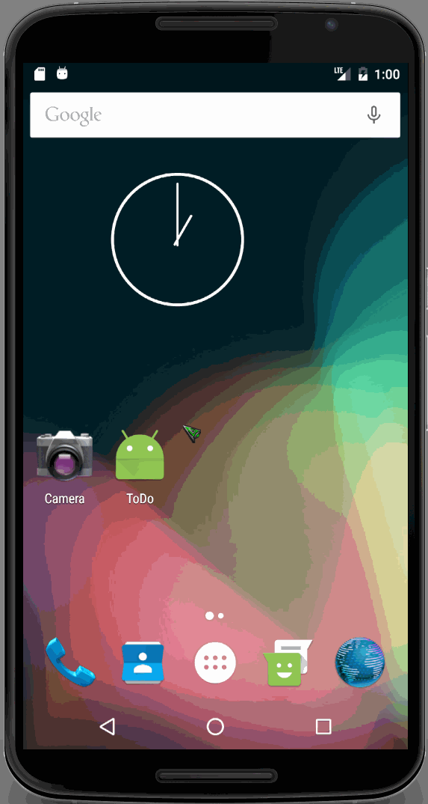

# Pre-work - ToDo

ToDo is an android app that allows building a todo list and basic todo items management functionality including adding new items, editing and deleting an existing item.

Submitted by: David Zhuohao Shao

Time spent: 11 hours spent in total

## User Stories

The following **required** functionality is completed:

* [X] User can **successfully add and remove items** from the todo list
* [X] User can **tap a todo item in the list and bring up an edit screen for the todo item** and then have any changes to the text reflected in the todo list.
* [X] User can **persist todo items** and retrieve them properly on app restart

The following **optional** features are implemented:

* [X] Persist the todo items [into SQLite](http://guides.codepath.com/android/Persisting-Data-to-the-Device#sqlite) instead of a text file
* [X] Improve style of the todo items in the list [using a custom adapter](http://guides.codepath.com/android/Using-an-ArrayAdapter-with-ListView)
* [X] Add support for completion due dates for todo items (and display within listview item)
* [X] Use a [DialogFragment](http://guides.codepath.com/android/Using-DialogFragment) instead of new Activity for editing items
* [X] Add support for selecting the priority of each todo item (and display in listview item)
* [ ] Tweak the style improving the UI / UX, play with colors, images or backgrounds

The following **additional** features are implemented:

* [ ] List anything else that you can get done to improve the app functionality!

## Video Walkthrough 

Here's a walkthrough of implemented user stories:

GIF created with [LiceCap](http://www.cockos.com/licecap/).

## Notes

Figuring out how to see content in the File Explorer in Android Device Monitor required some research. Apparently
when using a virtual device with API 25 it doesn't show anything. I had to change the device to use API 23 for it
to work properly.
I had a lot of trouble modifying table columns after I started using FlowDB and decided to update my TodoItem model.
I tried using migrations but couldn't get it to work. Eventually decided it was faster to simply uninstall the app
and start with fresh database every time I had to change the model, though I realize this would not work for an app
that's live in production.

## License

    Copyright [2017] [David Zhuohao Shao]

    Licensed under the Apache License, Version 2.0 (the "License");
    you may not use this file except in compliance with the License.
    You may obtain a copy of the License at

        http://www.apache.org/licenses/LICENSE-2.0

    Unless required by applicable law or agreed to in writing, software
    distributed under the License is distributed on an "AS IS" BASIS,
    WITHOUT WARRANTIES OR CONDITIONS OF ANY KIND, either express or implied.
    See the License for the specific language governing permissions and
    limitations under the License.